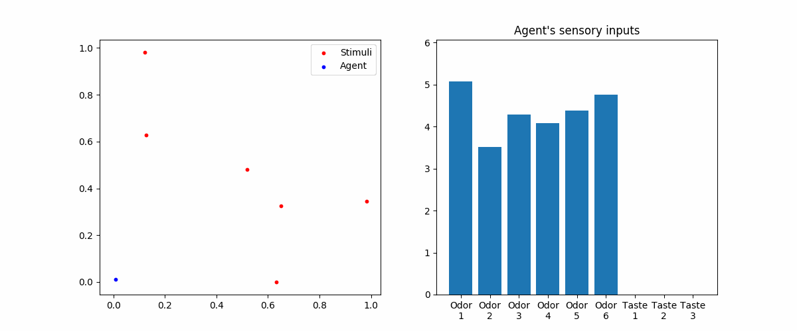

Some initial materials created for this project.

```odor.csv``` is a small dataset of common chemicals, their odors, and legal limit. ```odor_EDA``` is an attempt of exploratory data analysis on it. 

```Designed relations among abstract odors, tastes, and preference``` is one simple way I thought of to represent stimuli. It can be a starting point. 

```neural_network``` is a simple neural network that I am currently mainly working on, and ```simple_neural_network_animation``` is a script for live animating the neural_network class. An example (```animation.gif```):

This neural network actually only has sensory receptors, olfaction and gustation. Olfactory stimuli can be sensed from any distance, but gustatory stimuli can only be sensed within a circle around a stimulus source.

The three jupyter-notebooks, ```inference, cue combination```, and ```prediction``` are not necessarily relavent to this project, but are attempts to construct neural networks with feedforward, feedback, and prior drives. They are actually parts of my computational neuroscience final project, and are based on David Heeger's *Theory of Cortical Function* (*PNAS*, 2017).
